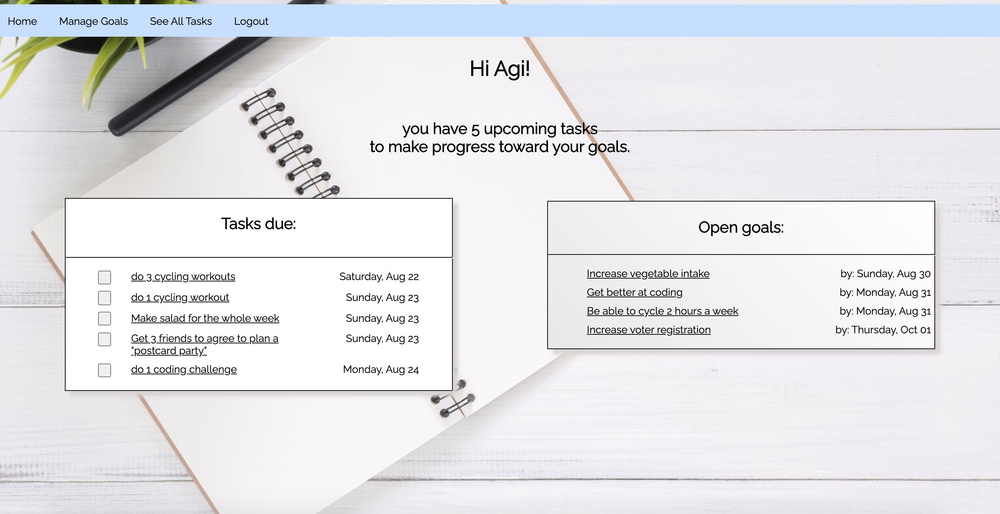

# Rails Goal Tracker App

A goal tracking app that allows a user to create and track a tangible plan for achieving each of their personal goals.

A Rails-powered web application created as part of the [Flatiron School's Online Web Developer program](https://flatironschool.com/).

## Features 🌟

* Create, edit and complete goals
* Create tasks that put goals into existence, and manage them over time

### Built With 

* Ruby on Rails
* CSS, including Flexbox and Grid
* Planned using Figma and Draw.io. Planning documents featured on [blog](https://medium.com/agi-coding-bootcamp/successfully-planning-a-software-engineering-bootcamp-project-8536b5a81180).

## Demo 🖥

See your upcoming tasks and open goals:

Add a goal, and then tasks will lead up the acheivement of that goal:

Check off tasks and add notes to goals:

### Get Started

Visit the live site: https://rails-goal-tracker.herokuapp.com

Alternatively, install:
* fork this repository
* git clone to your local directory
* cd GoalTracker
* run bundle install
* run rake db:migrate
* run rake db:seed
* run rails s and open in your favorite browser

## Contributors Guide 👋

Bug reports and pull requests are welcome on GitHub at https://github.com/agiletkiewicz/goal-tracker. This project is intended to be a safe, welcoming space for collaboration, and contributors are expected to adhere to the [Contributor Covenant](http://contributor-covenant.org) code of conduct.

### Code of Conduct

Everyone interacting in the Rails Goal Tracker's codebases, issue trackers, chat rooms and mailing lists is expected to follow the code of conduct.

### License

The app is available as open source under the terms of the [MIT License](https://opensource.org/licenses/MIT).
